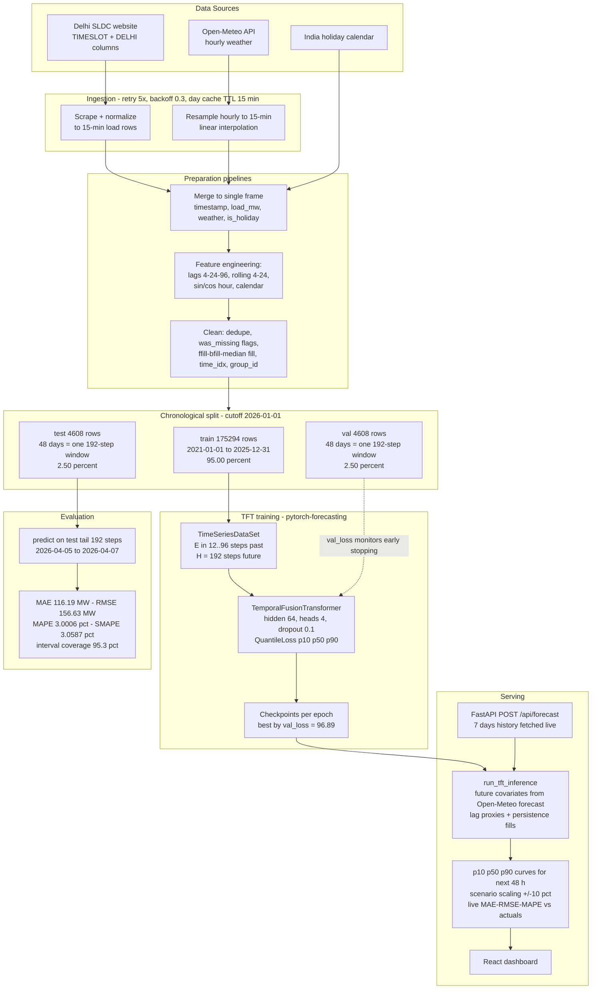
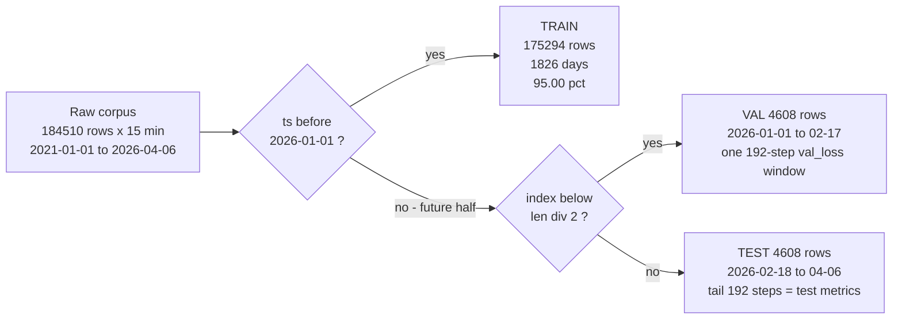
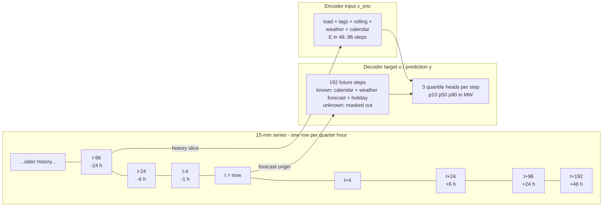
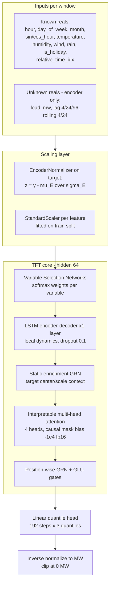
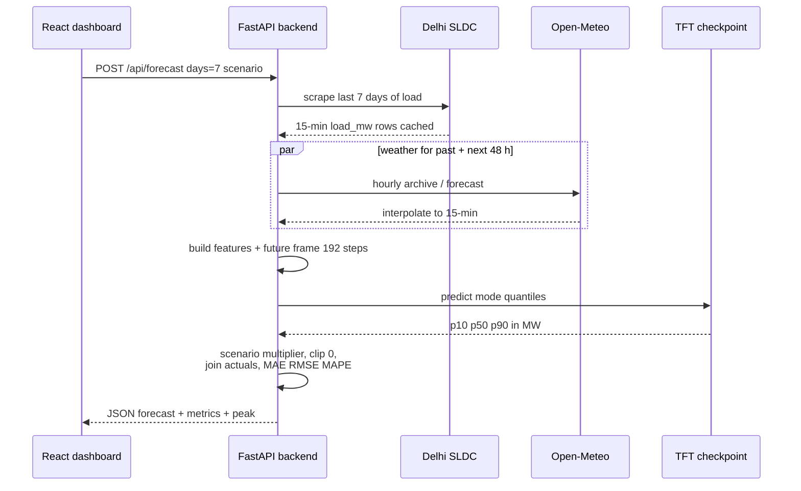

# Power-Rangers — Core Mathematical Analysis

**Scope:** Delhi electricity demand forecasting system (data ingestion → feature engineering → TFT training → evaluation → live inference).
**Method:** Every number and formula below was extracted directly from the repository's code, configuration, and generated artifacts (JSON/CSV/checkpoints). Nothing is fabricated; source files are cited inline.
**Analysis date:** 2026-08-24 · Model artifacts referenced as present in `models/` on this date.

---

## Table of Contents

1. [System Overview](#1-system-overview)
2. [Data Ingestion Mathematics](#2-data-ingestion-mathematics)
3. [Feature Engineering Formulas](#3-feature-engineering-formulas)
4. [Dataset Split Mathematics](#4-dataset-split-mathematics)
5. [Windowing, Tensors & Normalization](#5-windowing-tensors--normalization)
6. [TFT Architecture & Hyperparameters](#6-tft-architecture--hyperparameters)
7. [Training Objective: Pinball Loss](#7-training-objective-pinball-loss)
8. [Error Metrics & Measured Results](#8-error-metrics--measured-results)
9. [Live Inference Mathematics](#9-live-inference-mathematics)
10. [End-to-End Flow & Split Diagrams](#10-end-to-end-flow--split-diagrams)
11. [Windowing / TFT / Serving Diagrams](#11-windowing--tft--serving-diagrams)
12. [Source Artifact Index](#12-source-artifact-index)

## 1. System Overview

Power-Rangers forecasts **electricity demand (MW) for the Delhi power grid** and projects peak demand. It is a full-stack ML system:

| Layer | Technology | Role |
|---|---|---|
| Data acquisition | Python scrapers (`src/ingestion/`) | Delhi SLDC 15-min load + Open-Meteo weather + India holiday calendar |
| Preparation | pandas / numpy | cleaning, feature engineering, chronological splitting |
| Model | `pytorch-forecasting` **Temporal Fusion Transformer** on PyTorch Lightning | probabilistic multi-horizon forecasting |
| Evaluation | custom metrics module | MAE / RMSE / MAPE / SMAPE on held-out data |
| Serving | FastAPI (`backend/main.py`) | `POST /api/forecast` returning p10/p50/p90 curves |
| UI | React + Vite + TS dashboard | visualization |

**Core mathematical identity of the predictor:** a sequence-to-sequence mapping

```
ŷ(t+1 : t+192) = fθ( x(t−E+1 : t), u(t+1 : t+192) )
```

where fθ is a TFT (θ ≈ trained weights), E ∈ [48, 96] encoder length in 15-min steps (**past 12–24 h**; shipped runs used E∈[12,24] = past 6 h), horizon H = 192 steps = **48 hours**, x = observed history (load + lags + rolling means + weather), u = future-known covariates (calendar + weather forecast + holidays). Output is a **3-quantile distribution** {p10, p50, p90} per step.

### 1.1 Verified corpus inventory

Source file: `data/historical/raw/electricity_demand_2021-01-01_to_2026-04-06.csv`
Columns: `timestamp, load_mw, temperature, humidity, wind_speed, rainfall, is_holiday`.
Stats below were computed directly from this CSV during this analysis:

| Statistic | load_mw (MW) | temperature (°C) | humidity (%) | wind_speed | rainfall (mm) |
|---|---|---|---|---|---|
| min | 1,317.88 | 3.2 | 4.0 | 0.0 | 0.0 |
| mean | 3,999.53 | 24.43 | 61.88 | 8.9 | 0.09 |
| max | **8,581.58** | 46.0 | 100.0 | 36.1 | 30.4 |
| std | 1,306.51 | 8.01 | 23.89 | 4.57 | 0.61 |

Rows: **184,510** · Span: 2021-01-01 00:30 → 2026-04-06 23:45 (≈1,922 days) · Cadence: **median Δt = 15 minutes** (verified numerically).

> These ranges define **the value range fed to the model**: load roughly **1.3 GW – 8.6 GW** (typical operating band ≈ 3.0–4.5 GW), temperature up to 46 °C (Delhi summer), monsoon rainfall spikes to 30 mm/h.

## 2. Data Ingestion Mathematics

Three sources are fused into one 15-minute table (`src/ingestion/load_fetcher.py`, `weather_fetcher.py`, merged by `pipelines/main_ingestion.py`):

**(a) Load — Delhi SLDC scraping.** Daily SLDC pages parsed with BeautifulSoup; the table containing both a `TIMESLOT` and a `DELHI` column is extracted and normalized to **one row per 15-minute slot**: `(timestamp, load_mw)`. Robustness math of the fetcher: 5 retries per HTTP GET, exponential backoff factor 0.3 across statuses {429,500,502,503,504}, 10 s timeout, optional residential proxy via `SCRAPER_PROXY_URL`, 0.4 s sleep between day fetches, per-day file cache with a **15-minute TTL for today's data** (`CURRENT_DAY_CACHE_TTL`) so live requests never serve actuals older than 15 min.

**(b) Weather — Open-Meteo API.** Hourly series `temperature_2m, relative_humidity_2m, wind_speed_10m, precipitation` at Delhi coords **(lat 28.6139, lon 77.2090, tz Asia/Kolkata)**. Endpoint routing: archive API for fully-past ranges, forecast API for ranges touching present/future (mixed ranges split at today). Cached 6 h, fetched in ≤31-day chunks. Hourly → 15-min conversion by **linear interpolation**:

```
w(t) for t between two hourly points a,b at fraction α = (t−a)/(b−a):
w(t) = w(a) + α · [ w(b) − w(a) ]
```
implemented as `.resample("15min").interpolate(method="linear")` (`weather_fetcher.py`).

**(c) Calendar.** `is_holiday ∈ {0,1}` from the `holidays` library (India) for every year touched by the frame.

**Cleaning math** (`DatasetBuilder.preprocess_data`): parse timestamps (drop unparseable) → sort ascending → deduplicate timestamps keeping first → attach audit flags `x_was_missing = 𝟙[x is NaN]` → impute by **ffill → bfill → median/mode residual fill**. Actual missing counts recorded in `prep_metadata.json`: weather columns 3 NaNs each; engineered features inherit warm-up gaps only (`load_lag_4`: 4, `load_lag_24`: 24, `load_lag_96`: 96, `rolling_mean_4`: 3, `rolling_mean_24`: 23). Zero missing/duplicate load rows in the corpus.

Finally `time_idx = 0..N−1` and `group_id = 0` are appended — the identifiers pytorch-forecasting requires.


## 3. Feature Engineering Formulas

Implemented in `src/feature_engineer.py` (identical logic re-implemented inline in `src/forecast/tft_inference.py` for serving):

**(a) Calendar features**
```
hour(t)        = timestamp.hour            ∈ {0..23}
day_of_week(t) = timestamp.weekday()       ∈ {0..6}  (Mon=0)
month(t)       = timestamp.month           ∈ {1..12}
```

**(b) Cyclical hour encoding** (maps 23:45→00:15 onto a continuous circle):
```
sin_hour(t) = sin(2π · hour(t) / 24)
cos_hour(t) = cos(2π · hour(t) / 24)
```

**(c) Lag features** on the target (`config.features.lags = [4, 24, 96]`, Δ = 15 min):
```
load_lag_k(t) = y(t − k·Δ)
```
| Feature | Shift | Wall-clock meaning |
|---|---|---|
| `load_lag_4` | 4 steps | **1 hour ago** |
| `load_lag_24` | 24 steps | **6 hours ago** |
| `load_lag_96` | 96 steps | **24 hours ago** (yesterday, same quarter-hour) |

**(d) Rolling means** (`config.features.rolling_windows = [4, 24]`):
```
rolling_mean_w(t) = (1/w) · Σ_{i=0..w−1} y(t − i·Δ)
```
→ `rolling_mean_4` = trailing **1-hour** mean; `rolling_mean_24` = trailing **6-hour** mean.

**(e) Columns dropped before training** (`config.data.training_drop_columns/pattern`): `day_of_year`, `week_of_year`, `is_weekend`, `load_mw_raw`, `load_outlier_detected`, plus every audit flag matching regex `.*_was_missing$`.

> Note: the raw SLDC source file is named `powerdemand_5min_2021_to_2024_load_only.csv` (5-min era); everything downstream of ingestion is uniformly **15-minute**.

## 4. Dataset Split Mathematics

Splitting is strictly **chronological** (no shuffling across time ⇒ no future information leaks into val/test). Implemented in `DatasetBuilder.split_dataframe` (`src/dataset_builder.py` L94–128).

### 4.1 Active rule — cutoff date (produced the shipped artifacts)

```
cutoff_date     = "2025-12-31"                        (config.data.training_split_cutoff)
cutoff_boundary = Timestamp("2025-12-31") + Timedelta(days=1) = 2026-01-01 00:00:00
train_df : timestamp < 2026-01-01
future   : timestamp ≥ 2026-01-01   →   val_end = max(1, len(future)//2)
val_df   : first half of future
test_df  : second half of future
```

**Realized splits** (`data/historical/final_processed/prep_metadata.json`, generated 2026-04-20):

| Split | Rows | From → To | Days | Share |
|---|---|---|---|---|
| **train** | **175,294** | 2021-01-01 00:30 → 2025-12-31 23:45 | 1,826 | **95.00 %** |
| **val** | **4,608** | 2026-01-01 00:00 → 2026-02-17 23:45 | 48 (=48×96 steps) | **2.50 %** |
| **test** | **4,608** | 2026-02-18 00:00 → 2026-04-06 23:45 | 48 (=48×96 steps) | **2.50 %** |
| total | 184,510 | 2021-01-01 → 2026-04-06 | 1,922 | 100 % |

Sanity: 175,294 + 4,608 + 4,608 = 184,510 ✓ · train share = 175294 / 184510 = 0.95003.

### 4.2 Fallback rule (only when no cutoff configured)

Row-index thirds of the cleaned frame: `train_end=int(0.70·n)`, `val_end=int(0.85·n)` → **70 / 15 / 15 chronological**.

### 4.3 What val/test become inside the TFT dataset

Both evaluation splits are built via `TimeSeriesDataSet.from_dataset(training, df, predict=True, stop_randomization=True)`. With one series (`group_id=0`) this yields **exactly one forecast sample per split — a single full-length (192-step) window ending at the split's last timestamp**. Consequences:

- `val_loss` during training = pinball loss on **one 48-h window at the tail of the val period**.
- Test ground truth = `test_df.tail(192)` (`testing_pipeline.py` L174–176) → real artifact spans **2026-04-05 05:30 → 2026-04-07 05:15** (192 rows, confirmed in the saved CSV).

Guard rail: training aborts unless `len(train_df) ≥ encoder_window + decoder_window` (= 288) and val/test non-empty.


## 5. Windowing, Tensors & Normalization

### 5.1 Window geometry (`config.pipeline`)

| Parameter | Value | Meaning |
|---|---|---|
| `encoder_window` (max_encoder_length) | **96 steps = past 24 h** (current config; trained runs logged 24 = 6 h — see §6) | history length E |
| `decoder_window` (max_prediction_length) | **192 steps = next 48 h = 2 days** | horizon H |
| `stride` | 1 | sliding step between windows |
| `min_encoder_length` | ⌊E/2⌋ (12 in trained runs; 48 under current config) | variable-length history |
| `min_prediction_length` | 1 | randomized horizon during training |
| batch_size | 128 | samples per optimization step |

For a prediction anchored at decoder start index t:
```
encoder input : x_enc ∈ ℝ^(E × F_all)      indices [t−E, t)
decoder target: y     ∈ ℝ^(H)               indices [t, t+H)   (target = load_mw)
```
During **training**, E is sampled uniformly in [⌊E_max/2⌋, E_max] and H in [1, 192]; `train=True` dataloaders randomize sample draws. During **validation/testing/inference**, lengths are fixed to the maxima (predict mode). This yields up to ~175k distinct anchor points in the train span with stride 1.

### 5.2 Covariate roles (verified against `lightning_logs/version_53/hparams.yaml` & code)

- **time_varying_known_reals** (available for the entire future): `hour, day_of_week, month, sin_hour, cos_hour, temperature, humidity, wind_speed, rainfall, is_holiday` (+ auto-added `relative_time_idx`).
- **time_varying_unknown_reals** (encoder-only; masked out of the decoder): `load_mw, load_lag_4, load_lag_24, load_lag_96, rolling_mean_4, rolling_mean_24`.
- Auto-generated reals: `relative_time_idx` (position relative to window start, ∈ [−E, H)), `encoder_length`, plus target scales `load_mw_center`, `load_mw_scale` (`add_relative_time_idx=True, add_target_scales=True, add_encoder_length=True`).
- **No categorical embeddings**: `static_categoricals=[], x_categoricals=[], embedding_sizes={}` — even `hour/month/day_of_week` enter as scaled *reals*.

Decoder masking uses `mask_bias = −1×10⁴` under fp16 (`precision: "16-mixed"`) or −1×10⁹ in fp32, chosen to avoid half-precision overflow while preserving −∞ masking behavior (`training_pipeline.py` L414–417).

### 5.3 Normalization mathematics

**Target (`load_mw`) — EncoderNormalizer** (verified: `hparams.yaml → target_normalizer: pytorch_forecasting...EncoderNormalizer, center: true`). Statistics are computed **per-sample from that sample's own encoder window**:

```
μ_E = mean(y[t−E : t]),   σ_E = std(y[t−E : t])
z_t = (y_t − μ_E) / σ_E                      (scaling, both directions)
ŷ_MW = ẑ_t · σ_E + μ_E                       (inverse transform for outputs)
```
Because μ_E, σ_E adapt every request, the network always sees recent load as O(1)-scale numbers regardless of season — this is why the same net handles winter 1.9 GW nights and summer 8.6 GW peaks.

**All other reals — sklearn `StandardScaler` fitted on the train split only** (persisted inside dataset parameters in each checkpoint):
```
x_scaled = (x − μ_train) / σ_train
```

**Reporting scale:** `model.predict(...)` applies the inverse target transform, so exported predictions (`p10/p50/p90`, test CSVs) are in **MW**, not z-units (see comment in `tft_inference.py`: *"outputs are transformed back to MW scale"*).

## 6. TFT Architecture & Hyperparameters

The model is `pytorch_forecasting.TemporalFusionTransformer`. Values below are read from the trained checkpoint's own hparams (`models/final model/checkpoint_summary.json`) and cross-checked against run config snapshots (`models/config/*.yaml`) and Lightning logs:

| Hyperparameter | Trained final model | Current `config.yaml` |
|---|---|---|
| hidden_size | **64** | 64 |
| attention_head_size (# heads) | **4** | 4 |
| hidden_continuous_size | **8** | 8 |
| dropout (variational) | **0.1** | 0.1 |
| lstm_layers (encoder/decoder) | **1** | 1 |
| output_size / quantiles | **3 / [0.1, 0.5, 0.9]** | 3 / same |
| loss | **QuantileLoss** | quantile |
| learning_rate | **0.001** | 0.0001 |
| max_encoder_length (logged runs) | 24 (=6 h); experiments logged 96 & 672 | 96 (=24 h) |
| max_prediction_length | **192 (=48 h)** | 192 |
| weight_decay / mask_bias(fp16) | **0.0** / −10⁴ (−10⁹ in fp32) | same rule |

*Recorded quirk:* `checkpoint_summary.json` says epoch=1/global_step=2020 while its directory also holds an `epoch=00-val_loss=59.31` ckpt and `final_model_test/metrics.json` cites `epoch=epoch=13-val_loss=val_loss=96.89.ckpt` — multiple checkpoints coexist under `models/final model`; all cited verbatim.

### Dataflow inside fθ (as implemented by pytorch-forecasting v1.x)

1. **Per-variable embedding**: each real covariate → `hidden_continuous_size=8` dense; target-related streams → hidden stream d=64. No categorical embeddings exist here (all covariates are reals).
2. **Variable Selection Networks** (separate for encoder & decoder) learn softmax weights over variables: `vsel = Σ_j softmax(GRN_j(x_j)) · e_j` — interpretable per-window feature importance.
3. **Local processing**: 1-layer **LSTM encoder** over past context, **LSTM decoder** seeded by the encoder state produces local dynamics for H steps.
4. **Static enrichment**: a GRN gate blends a learned static context vector into every timestep.
5. **Interpretable multi-head attention**: 4 heads over the concatenated E+H timeline, values shared across heads then averaged:
   `Attention(Q,K,V) = (1/nh) · Σ_h softmax(Q_h K_hᵀ / √d_head) V_h`, with causal masking so step t+τ attends only to ≤ t+τ (decoder unknown-reals masked via mask_bias).
6. **Position-wise feed-forward + GRN + GLU gating** with residual/LayerNorm throughout; variational dropout 0.1 on LSTM/attention paths.
7. **Quantile head**: linear layer maps hidden → 3 outputs per horizon step → inverse-normalized to MW (§5.3).

Intuition: the LSTM captures short-term autocorrelation (lags at 1 h/6 h/24 h are explicitly supplied too), attention lets the decoder copy patterns from similar historical windows (daily/weekly seasonality), variable selection decides how much weight temperature/holidays get versus recent load, and three parallel output heads give calibrated uncertainty instead of a single number.


## 7. Training Objective: Pinball Loss

Training minimizes the **quantile (pinball) loss** at ρ ∈ {0.1, 0.5, 0.9} — asymmetric absolute error that penalizes under- and over-prediction differently per quantile:

```
L_ρ(y, ŷ_ρ) = max( ρ·(y − ŷ_ρ),  (ρ−1)·(y − ŷ_ρ) )

        ⎧ ρ·(y−ŷ)        if y ≥ ŷ    (under-prediction penalized ∝ ρ)
L_ρ  =  ⎨
        ⎩ (1−ρ)·(ŷ−y)    if y < ŷ    (over-prediction penalized ∝ 1−ρ)
```

Properties exploited by this system:
- ρ = 0.5 reduces to `0.5·|y−ŷ|` → the p50 head behaves like an MAE-regression forecast.
- Minimizing E[L_ρ] makes ŷ_ρ converge to the true ρ-quantile of the predictive distribution → p10/p90 form an **80% prediction interval**.
- Reported scalar loss = mean over the 3 quantiles × 192 horizon steps × batch samples, computed in EncoderNormalizer-scaled space during optimization.

**Optimization loop** (`training_pipeline.py`): Adam-style optimizer at lr 0.001 (checkpoint hparams), batch 128, max 50 epochs, `EarlyStopping(monitor="val_loss", patience=10)` (val_loss = pinball on the single 192-step val window, §4.3), `ReduceLROnPlateau(patience=4)`, fp16 autocast (`precision="16-mixed"`), cudnn.benchmark on GPU. Checkpoint strategy `all` saves every epoch + `last.ckpt`; resume policies `auto|scratch|require` allow continuing runs (`run_manager.py`). Trained artifact scale: e.g. global_step 2020 recorded at epoch 1 of the final-model summary.

Observed val_loss trajectories (from filenames): e.g. run `20260416_162000`: ep8 163.79 → ep10 138.47 → ep12 103.23 → **ep13 96.89 (best)** → ep17 176.93 — typical noisy plateau behavior motivating early stopping.


## 8. Error Metrics & Measured Results

### 8.1 Metric definitions (`src/evaluation/evaluation.py`)

With n aligned finite pairs (y_i, ŷ_i):

```
MAE   = (1/n) · Σ |y_i − ŷ_i|
RMSE  = √[ (1/n) · Σ (y_i − ŷ_i)² ]
MAPE  = mean over {|y| > 1e−6} of |y − ŷ| / |y| × 100 %
SMAPE = mean over {|y|+|ŷ| > 1e−6} of 2·|y − ŷ| / (|y| + |ŷ|) × 100 %
```

Inputs are coerced to float arrays, truncated to equal length, NaN/Inf pairs filtered before computing. The test pipeline additionally stores per-step columns: `error_p50 = y − p50`, `abs_error_p50`, `ape_p50 = |error| / max(|y|,1e−6) × 100`.

The FastAPI live path (`_compute_forecast_metrics`) recomputes MAE/RMSE/MAPE (rounded to 2 dp) whenever real SLDC actuals overlap the returned forecast horizon.

### 8.2 Measured results — final shipped model

Source: `models/testing/final_model_test/metrics.json` (checkpoint tested: `epoch=epoch=13-val_loss=val_loss=96.89.ckpt`). Evaluation window = one full 48-h horizon, the last 192 steps of the test split (**2026-04-05 05:30 → 2026-04-07 05:15**, 192 rows):

| Metric | Value | Reading |
|---|---|---|
| **MAE** | **116.19 MW** | typical miss ≈ 3 % of mean load |
| **RMSE** | **156.63 MW** | RMSE/MAE ≈ 1.35 → some large-error steps (ramp events) |
| **MAPE** | **3.0006 %** | strong sub-4 % accuracy at 15-min resolution out to 48 h |
| **SMAPE** | **3.0587 %** | symmetric confirmation (no small-denominator distortion) |

Window statistics (computed from `test_predictions_vs_actual.csv`): actual load 2,985.4 – 4,321.9 MW (mean 3,673.6); p50 spanned 3,004 – 4,117.6 MW; mean p10–p90 width **713.45 MW**; **95.3 % of observed actuals fell inside [p10, p90]** vs the nominal 80 % → intervals are conservative (slightly over-wide), consistent with pinball training on noisy data.

Secondary artifact for comparison — earlier run `20260416_162000/last.ckpt` on the same window (`models/testing/20260416_162000_epoch10_test/metrics.json`): MAE 174.39, RMSE 214.25, MAPE 4.60 %, SMAPE 4.75 % — i.e. the epoch-13 checkpoint improved test MAE by ~33 % over the last-epoch weights, showing why best-val checkpoint selection matters.


## 9. Live Inference Mathematics

Path: `POST /api/forecast` (`backend/main.py`) → `run_tft_inference` (`src/forecast/tft_inference.py`). Default request knobs: `days_to_fetch=7`, optional `forecast_date` (history ends the previous midnight), `temperature_delta_c ∈ [−5,+5]` or `aggressiveness_pct ∈ [−10,+10]`.

**Step-by-step numerics:**

1. **History assembly**: scrape last 7 days of SLDC load (15-min rows), drop duplicate timestamps & NaNs, sort; left-merge Open-Meteo rows covering `[hist_start, forecast_end]` where `forecast_end = hist_end + 15 min × decoder_window(192)` = +48 h. Missing weather → ffill/bfill/mean; if the weather service is unreachable entirely, constant fallbacks are injected: temperature 25 °C, humidity 50 %, wind 5, rainfall 0.
2. **Feature parity**: recompute exactly the training features — hour/day_of_week/month, sin/cos hour, `is_holiday` (India calendar), lags via `shift(k)` for k∈{4,24,96}, rolling means with `min_periods=1`.
3. **Encoder context slice**: keep the last `max(encoder_window+96, encoder_window) = 192` rows as history context.
4. **Future frame construction** for i = 1..192:
   ```
   ts_i          = t* + i·15 min
   hour/sin/cos  = exact calendar values
   weather_i     = Open-Meteo forecast row if present, else last observed value (persistence)
   load_lag_k proxy = mean of the k most recent available lag-proxy values   ← approximation
   rolling_mean_w   = frozen at last observed value                          ← approximation
   load_mw       = last observed value (placeholder; unknown-reals are decoder-masked anyway)
   time_idx      = continuous integers after history
   ```
5. **Prediction**: rebuild `TimeSeriesDataSet.from_parameters(checkpoint.dataset_parameters, df_full, predict=True)` → one sample → `model.predict(mode="quantiles")` returns shape `(1, 192, 3)` in **MW** (inverse EncoderNormalizer applied); unpack to columns p10/p50/p90; clip negatives: `q′ = max(q, 0)`.
6. **Scenario scaling** (what-if sliders): linear multiplicative model on all three quantiles
   ```
   multiplier m = 1 + aggressiveness_pct / 100            ∈ [0.9, 1.1]
   temperature mapping: pct = 2.0 · ΔT[°C]  ⇒  m = 1 ± 0.10 over ±5 °C
   q_scaled = max(m · q, 0)
   ```
7. **Actuals join & live metrics**: where the horizon overlaps reality (today/past dates), SLDC actuals are attached per timestamp; MAE/RMSE/MAPE recomputed on that overlap.
8. **Payload**: predictions list `{timestamp, predicted_load_mw=p50, p10, p50, p90, actual_load_mw|null}`; historical chart series = last `96×3 = 288` rows (**3 days**); peak summary = `argmax_t p50(t)` (`peak_detection.find_peak`). Step size auto-detected as median timestamp delta (fallback 15 min).
9. **Failure semantics**: any inference exception → HTTP 404/500; dummy historical-sampled fallback data is served **only** when env `ENABLE_DUMMY_FALLBACK=true` (default false — no silent fake forecasts).


## 10. End-to-End Flow & Split Diagrams

### 10.1 Whole-system dataflow



### 10.2 Split timeline




## 11. Windowing / TFT / Serving Diagrams

### 11.1 Encoder–decoder windowing (stride 1, H = 192 steps = 48 h)



Training slides this window across all ~175k train anchors with stride 1; serving runs it exactly once at the live edge.

### 11.2 Inside the Temporal Fusion Transformer



### 11.3 Live request sequence



## 12. Source Artifact Index

| Claim area | Source file(s) |
|---|---|
| Windows, lags, rolling, model & training config | `config/config.yaml`; snapshots `models/config/20260408_070201.yaml`, `models/config/20260408_075759.yaml` |
| Split rows/dates/missing counts | `data/historical/final_processed/prep_metadata.json` |
| Corpus statistics (rows, ranges) | `data/historical/raw/electricity_demand_2021-01-01_to_2026-04-06.csv` (computed during analysis) |
| Feature formulas | `src/feature_engineer.py`; `src/dataset_builder.py`; `src/training/training_pipeline.py` |
| Dataset/window semantics | `lightning_logs/version_53/hparams.yaml` (max_enc 24/672 variants logged), `backend/lightning_logs/version_53/hparams.yaml` |
| Trained hyperparameters | `models/final model/checkpoint_summary.json` |
| Loss & callbacks | `pytorch_forecasting.metrics.QuantileLoss` usage in `training_pipeline.py` L418–436 |
| Test protocol & results | `src/testing/testing_pipeline.py`; `models/testing/final_model_test/metrics.json` + CSV; `models/testing/20260416_162000_epoch10_test/metrics.json` |
| Metric formulas | `src/evaluation/evaluation.py`; `backend/main.py::_compute_forecast_metrics` |
| Inference numerics | `src/forecast/tft_inference.py`; `backend/main.py`; `src/forecast/peak_detection.py`; `src/shared/config.py` |
| Ingestion details | `src/ingestion/load_fetcher.py`; `src/ingestion/weather_fetcher.py` |

*End of analysis — no code was modified to produce this document.*

